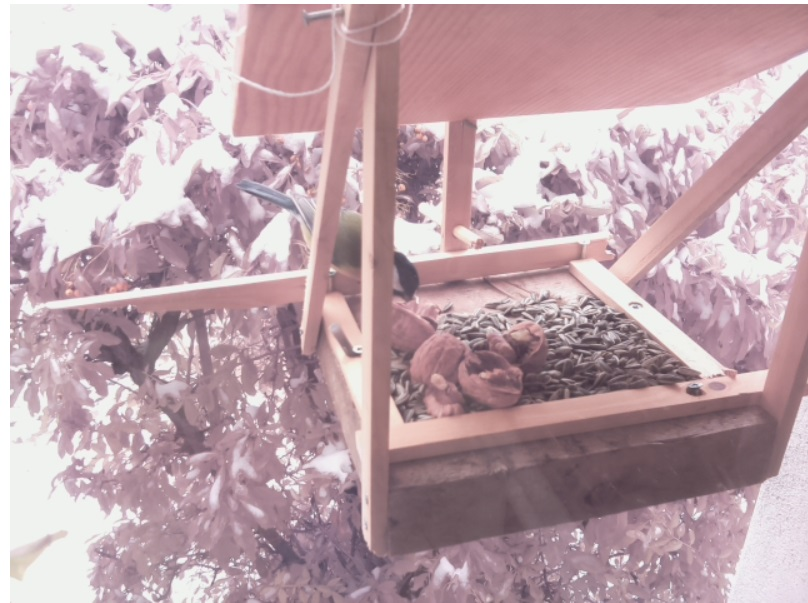

vogelhaus
=========

Das Vogelhaus

Setup Server
------------

If you want to set up the server you can do the following:

- Attach the Raspberry Pi camera to the Raspberry Pi (draw out the blocker, stick in the camera, stick in the blocker)
- Clone the repository
- Run [`install.sh`](./install.sh)
- Add the path of [`autostart.sh`](./autostart.sh) to `/etc/rc.local`, e.g. via `sudo nano /etc/rc.local`. It could look like `/home/pi/vogelhaus/autostart.sh`.
- restart

Setup WIFI HotSpot
------------------

If you would like to set the Raspberry Pi up so it serves an own WIFI, you can follow the tutorial at [www.pi-point.co.uk/documentation](http://www.pi-point.co.uk/documentation/).

Related Work
------------

You can enchance your [bird house with an infrared LED](https://projects.raspberrypi.org/en/projects/infrared-bird-box) to see birds nesting.
